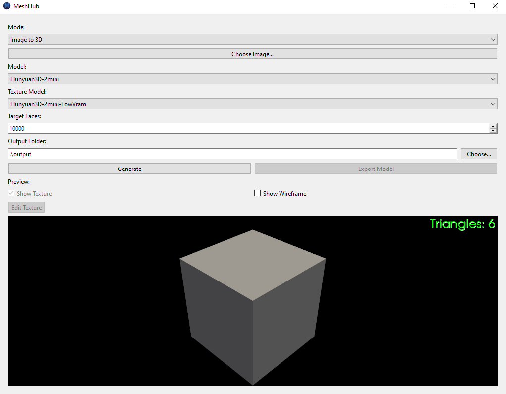
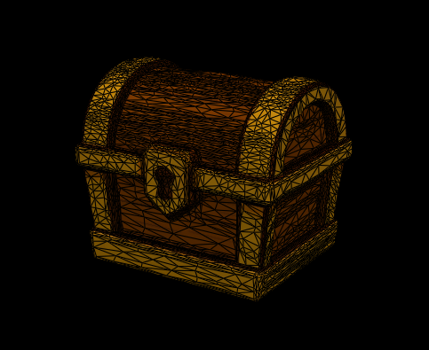
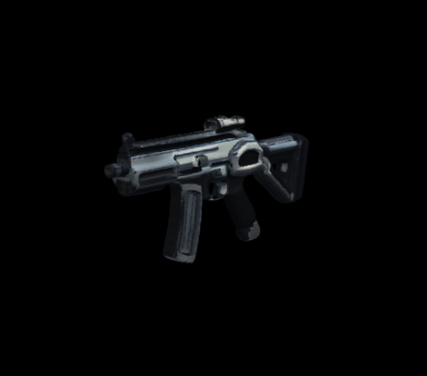

#  MeshHub


AI-powered 3D model creation and editing suite. MeshHub unifies open-source 3D generation, texturing, and editing tools into one cohesive, local-first workflow—ideal for game assets, prototyping, animation, and creative exploration.

---

## 🔍 Preview

### Interface

<p align="center">
  
</p>

### Sample Models

<p align="center" style="display: flex; align-items: center; justify-content: center; gap: 16px;">
  
  
  
</p>

---

## ✨ Key Features

- 🎨 **Text-to-3D & Image-to-3D Generation**: Create meshes directly from natural language prompts or concept art.
- 🖌️ **Texture Generation & Inpainting**: Apply AI-assisted textures or hand-paint corrections directly on your models.
- 🔄 **Rotating 3D Preview**: Orbit, zoom, and inspect your model in real-time within the built-in viewer.
- 🧩 **Local & Open-Source First**: All models run locally with CUDA acceleration—no hidden costs, no cloud lock-in.
- ⚡ **Pipeline Ready**: Export meshes in a common format (GLB) ready for game engines and 3D workflows.
- 🛠️ **Extensible Architecture**: Easily swap in new generation models or rendering backends as open-source advances.

---

## 🛠️ Installation & Build

### Requirements

- Python 3.10+
- CUDA-enabled GPU with sufficient VRAM (8 GB recommended)
- pip, venv (or equivalent)

Setup

```bash
see BUILD.md
```

---

## 🚧 Roadmap

- Texture inpainting with brush controls
- Animation scaffolding and rigging tools
- Model simplification & 3D print export
- Plugin system for community model backends

---

## ❓ FAQ

**Does MeshHub require an API key?**
No. MeshHub runs fully local using open-source AI models (though you may add external providers if desired).

**What formats are supported?**
Currently: .glb More to come.

**Can I use MeshHub commercially?**
Yes—see the LICENSE for details.

---

## 🌐 Links

- [ MeshHub Website](https://www.keystoneintelligence.ai/meshhub)

---

## 📜 License

MeshHub is released under the [GNU General Public License v3.0](LICENSE).

---

## 🤝 Contributing

Contributions are welcome! Please see [CONTRIBUTING.md](CONTRIBUTING.md) for guidelines.